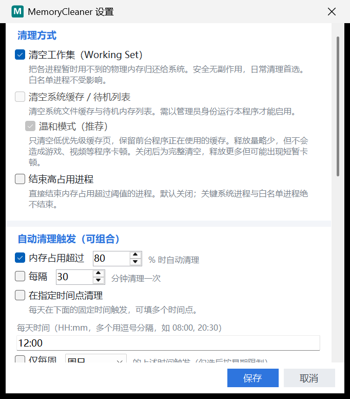

# MemoryCleaner

> A lightweight Windows system-tray memory cleaner with customizable triggers (threshold / interval / scheduled time), multiple clean methods, and an ultra-small single-file build.

轻量级 **Windows 系统托盘** 内存清理工具：可自定义 **阈值 / 定时 / 时间点** 触发，支持多种清理方式，单文件运行、占用极低。

[](https://github.com/ferrannn/MemoryCleaner/stargazers)
[](LICENSE)
[](https://dotnet.microsoft.com/)
[](https://www.microsoft.com/windows)
[](https://github.com/ferrannn/MemoryCleaner/releases)

---

## 📖 简介

Windows 用久了内存被各种进程和系统缓存悄悄占满，手动清理又麻烦。MemoryCleaner 常驻系统托盘，实时显示内存占用曲线，并在你设定的条件（占用过高 / 每隔一段时间 / 每天定时）下**自动、安静地清理内存**，全程无需干预。

适用于：内存较小的机器、长时间不关机、想让系统自动维持流畅的用户。

---

## ✨ 功能特性

- ✅ **三种清理方式**（可自由组合）
  - 清空工作集（Working Set）— `EmptyWorkingSet`，安全、最常用
  - 清空系统缓存 / 待机列表（Standby / Modified / 系统工作集）— 需管理员，含**温和模式**
  - 结束高占用进程 — 默认关闭，开启前需二次确认，强白名单保护
- ✅ **三种触发方式**（可任意组合）
  - 阈值触发：内存占用超过 X% 自动清理
  - 固定间隔：每隔 N 分钟清理
  - 定时点：每天 / 每周指定时间清理，可设多个时间点；错过（休眠、全屏、繁忙）会当天补上
- ✅ **系统托盘常驻**
  - 图标实时显示内存占用百分比（按占用率变色）
  - 右键菜单顶部展示最近内存占用**迷你曲线**（sparkline）
  - 清理后气泡提示释放量
- ✅ **游戏友好**：检测到全屏程序（游戏 / 播放器 / 演示模式）时自动跳过清理，不打断画面
- ✅ **全局热键**：任何界面按下即清理，组合键可自定义
- ✅ **便携模式**：程序目录放个 `portable.txt`，配置与历史即写在 exe 旁边，U 盘随身带
- ✅ **高占用进程列表**：先看清再处理，勾选白名单，绝不盲删
- ✅ **清理历史日志**：时间 / 触发方式 / 释放量 / 触及进程数，含累计统计
- ✅ **自动更新**：启动时 / 手动检查新版本，一键下载并自动替换重启
  - 下载窗口带**进度、速度、剩余时间**，可随时停止
  - 内置多个**国内加速源**，打开即测速并自动选中最快的一个
- ✅ **安全可靠**
  - 零第三方依赖（纯 Win32 P/Invoke + 内置库）
  - 单实例运行、防重入、最小清理间隔、全局异常兜底
  - 系统关键进程绝不清理 / 结束
  - **白名单进程既不会被结束，也不会被清理工作集** —— 游戏、剪辑软件加进去即可免打扰

---

## 📦 环境要求

| 版本 | 运行依赖 |
|---|---|
| **自包含版** | 无 —— Windows 10/11 x64 双击即用 |
| **框架依赖版** | 需先安装 [.NET 8 Desktop Runtime](https://dotnet.microsoft.com/zh-cn/download/dotnet/8.0) |

> 编译源码需要 [.NET 8 SDK](https://dotnet.microsoft.com/download/dotnet/8.0)。

---

## 🚀 快速开始

### 方式一：下载 Release（推荐）

从 [Releases](https://github.com/ferrannn/MemoryCleaner/releases) 下载，**两个版本二选一**：

| 文件 | 体积 | 优点 | 缺点 | 适合谁 |
|---|---|---|---|---|
| **`MemoryCleaner.exe`**（自包含） | ~68 MB | **免安装、零配置**，任何 Win10/11 双击就跑 | 体积大（自带 .NET 运行时） | **绝大多数普通用户（推荐）** |
| **`MemoryCleaner-fd.exe`**（框架依赖） | ~0.2 MB | 体积极小、启动略快 | 需先装 .NET 8 Desktop Runtime | 已装 .NET 8 / 追求极致体积的用户 |

> 💡 **怎么选**：不想折腾、怕报错 → 下 `MemoryCleaner.exe`；电脑已装过 .NET 8 → 下 `MemoryCleaner-fd.exe`，只有 0.2 MB。
>
> 💡 想启用「清理系统缓存」：右键 exe → **以管理员身份运行**。

### 方式二：自行编译

```bash
git clone https://github.com/ferrannn/MemoryCleaner.git
cd MemoryCleaner

# 自包含单文件（免安装，~68 MB）
dotnet publish src/MemoryCleaner -c Release -r win-x64 --self-contained true \
  -p:PublishSingleFile=true -p:IncludeNativeLibrariesForSelfExtract=true \
  -p:EnableCompressionInSingleFile=true -o publish

# 框架依赖单文件（极小，~0.2 MB，需 .NET 8 运行时）
dotnet publish src/MemoryCleaner -c Release -r win-x64 --self-contained false \
  -p:PublishSingleFile=true -o publish-framework-dependent
```

---

## 🖼️ 效果图

<!-- 截图放在 images/ 目录，用相对路径引用 -->



> 📌 托盘图标实时变色（绿 → 橙 → 红），右键菜单顶部是最近 5 分钟内存占用曲线。

---

## ⚙️ 配置说明

托盘图标 → 右键 → **设置**，或直接编辑 `%AppData%\MemoryCleaner\config.json`
（便携模式下为 exe 同目录的 `config.json`，具体路径见「关于」窗口）：

```jsonc
{
  "CleanWorkingSet": true,          // 清空工作集
  "CleanSystemCache": false,        // 清空系统缓存（需管理员）
  "SystemCacheGentle": true,        // 温和模式：只清低优先级缓存，避免卡顿
  "KillHighUsageProcesses": false,  // 结束高占用进程（默认关闭）

  "ThresholdEnabled": true,         // 阈值触发
  "ThresholdPercent": 80,

  "IntervalEnabled": false,         // 固定间隔触发
  "IntervalMinutes": 30,

  "ScheduleEnabled": false,         // 定时点触发
  "DailyTimes": ["12:00"],
  "WeeklyEnabled": false,
  "WeeklyDay": 0,                   // 0=周日

  "KillThresholdMB": 8192,          // 单进程工作集阈值
  "ProcessWhitelist": [],           // 进程白名单（清理与结束均跳过，不含 .exe）

  "SkipWhenFullscreen": true,       // 全屏程序运行时跳过自动清理
  "HotkeyEnabled": false,           // 全局热键（按下即清理）
  "HotkeyValue": 262221,            // Keys 组合值，默认 Ctrl+Shift+M
  "RunAtStartup": false,            // 开机自启
  "ShowNotification": true,         // 清理后通知
  "CheckUpdateOnStartup": true,     // 启动时检查更新
  "MinIntervalSeconds": 60          // 两次清理最小间隔
}
```

> 配置文件加载时会自动**钳制非法数值**，手改也不怕失控。

### 便携模式

在 **exe 所在目录**新建一个空文件 `portable.txt`，重启程序即可。此后 `config.json` 与 `history.json` 都写在 exe 旁边，不再往 `%AppData%` 里放任何东西 —— 适合 U 盘携带或绿色分发。

当前生效的路径可在 **托盘右键 → 关于** 里查看。

> ⚠️ 若程序装在 `Program Files` 等无写权限的位置，便携模式无法生效，会自动回退到 `%AppData%`，「关于」窗口会如实说明。

---

## 🛡️ 安全说明

- **「结束高占用进程」默认关闭**；开启后系统关键进程与白名单进程绝不会被结束。
- **「清理系统缓存」需要管理员权限**；非管理员运行时该选项自动灰置。
- 本工具只做**标准 Win32 内存管理调用**，不注入、不装驱动、不修改其他进程的内存数据。

---

## 🏗️ 项目结构

```
src/MemoryCleaner/
├─ Core/                # 清理器：工作集 / 系统缓存 / 高占用进程 / 历史 / 更新 / 全屏检测
├─ Scheduler/           # 调度引擎 + 三种触发器
├─ Config/              # 配置模型 / 持久化 / 路径解析 / 开机自启
├─ UI/                  # 托盘 / 设置 / 进程列表 / 历史 / 内存曲线 / 热键 / 关于
├─ Native/              # Win32 P/Invoke 声明
└─ TrayAppContext.cs    # 托盘主逻辑
```

---

## 🤝 贡献指南

欢迎提交 Issue 和 Pull Request：

1. Fork 本仓库
2. 创建特性分支 `git checkout -b feature/xxx`
3. 提交修改（请保持 `dotnet build` 0 警告 0 错误）
4. 发起 Pull Request

---

## 📄 许可证

[MIT License](LICENSE) © 2026 ferrannn
